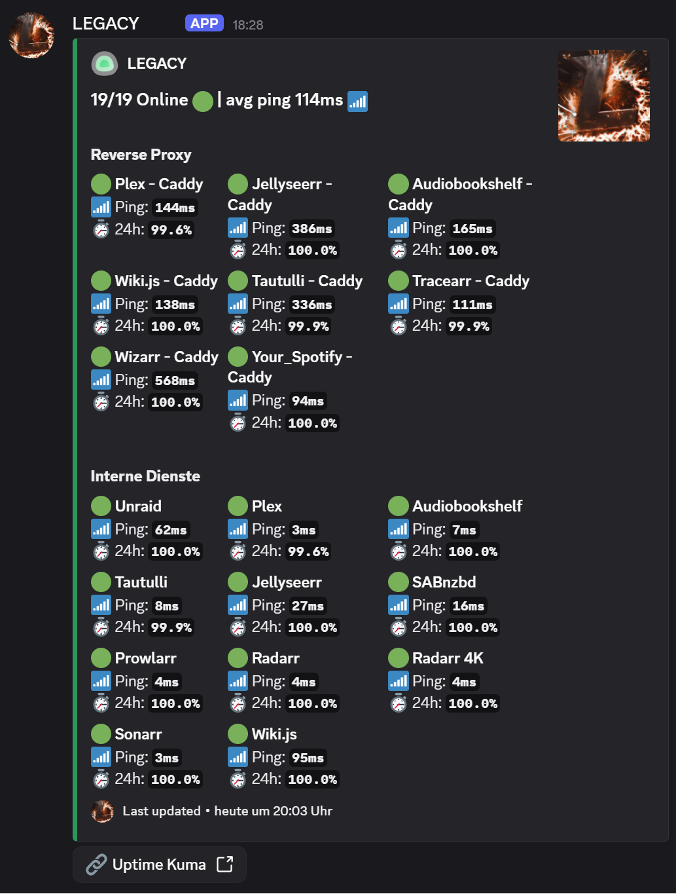
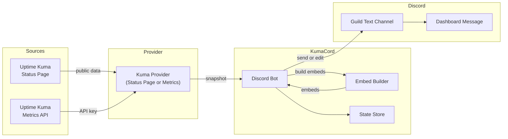

<h1 align="center">KumaCord</h1>

<p align="center">
  Uptime Kuma status dashboards, synced to Discord. One message, always current.
</p>

<p align="center">
  <a href="https://github.com/nichtlegacy/KumaCord/actions/workflows/build-docker-image.yaml">
    
  </a>
  <a href="https://ghcr.io/nichtlegacy/kumacord">
    
  </a>
  <a href="https://www.python.org/">
    
  </a>
  <a href="LICENSE">
    
  </a>
  <a href="https://github.com/nichtlegacy/KumaCord/releases">
    
  </a>
</p>

<p align="center">
  <a href="#quick-start">Quick Start</a> •
  <a href="#features">Features</a> •
  <a href="#setup">Setup</a> •
  <a href="#configuration">Configuration</a> •
  <a href="#architecture">Architecture</a> •
  <a href="#troubleshooting">Troubleshooting</a>
</p>

<p align="center">
  
</p>

## Features

- Keeps a single Discord message updated with live monitor status, ping, and 24h uptime.
- Works with Uptime Kuma public status pages or private Metrics API.
- Preserves Uptime Kuma groups and ordering when using Status Page mode.
- Auto-rotating Discord presence with live summary stats.
- Pulls status page branding (icon and banner) and caches assets locally.
- Docker-ready with persistent state and zero-downtime updates.

## Quick Start

### Docker (recommended)

1. Edit `docker-compose.yml` and set your environment values.
2. Run:

```bash
docker compose up -d
```

### Local (Python)

1. Copy the example environment file and fill it in:

```bash
cp .env.example .env
```

2. Install dependencies and run the bot:

```bash
python -m venv .venv
source .venv/bin/activate
pip install -r requirements.txt
python main.py
```

Windows PowerShell:

```powershell
python -m venv .venv
.venv\Scripts\Activate.ps1
pip install -r requirements.txt
python main.py
```

## Setup

Short version:

- Create a Discord app + bot token, invite the bot, and copy the channel ID.
- Pick Status Page mode or Metrics API mode in Uptime Kuma.
- Fill in `.env` (or `docker-compose.yml`) and start the bot.

<details>
<summary>Full setup guide (Discord + Uptime Kuma)</summary>

### 1) Discord bot token

1. Create a new application in the Discord Developer Portal.
2. Open the **Bot** tab and click **Reset Token** to generate a bot token.
3. Copy the token and store it as `DISCORD_BOT_TOKEN`.

Reference: [Building your first Discord app (Getting Started)](https://docs.discord.com/developers/quick-start/getting-started)

### 2) Invite the bot to your server

1. In the Developer Portal, open **Installation**.
2. Under Default Install Settings, add the `bot` scope.
3. Grant permissions:

- Send Messages
- Embed Links
- Attach Files
- Read Message History
4. Copy the generated install link and invite the bot to your server.

Reference: [Building your first Discord app (Install links + scopes)](https://docs.discord.com/developers/quick-start/getting-started)

### 3) Get the Discord channel ID

1. Enable Developer Mode in Discord.
2. Right-click the target channel and choose **Copy ID**.
3. Store it as `DISCORD_CHANNEL_ID`.

Reference: [Where can I find my User/Server/Message ID?](https://support.discord.com/hc/en-us/articles/206346498-Where-can-I-find-my-User-Server-Message-ID)

### 4) Uptime Kuma access

Choose one of the following modes:

**Mode A: Status Page (plug & play)**

- Create a public status page in Uptime Kuma.
- Use the status page URL: `https://your-host/status/<slug>`
- Set `KUMA_STATUSPAGE_URL`.

**Mode B: Metrics API (private)**

- Create an API key in Uptime Kuma **Settings > Security > API Keys**.
- Set `KUMA_API_URL` to your Uptime Kuma base URL.
- Set `KUMA_API_KEY` to the generated key.
- The `/metrics` endpoint uses HTTP Basic Auth when API Keys are enabled (empty username, API key as password).

Reference: [Uptime Kuma Internal API wiki](https://github.com/louislam/uptime-kuma/wiki/Internal-API)

</details>

## Configuration

`KUMA_API_URL` + `KUMA_API_KEY` take precedence over `KUMA_STATUSPAGE_URL`.

<details>
<summary>Show configuration variables</summary>

| Variable | Required | Default | Description |
| --- | --- | --- | --- |
| `DISCORD_BOT_TOKEN` | yes | none | Bot token from the Developer Portal. |
| `DISCORD_CHANNEL_ID` | yes | none | Target server text channel ID. |
| `KUMA_STATUSPAGE_URL` | no | none | Public status page URL (`/status/<slug>`). |
| `KUMA_API_URL` | no | none | Uptime Kuma base URL for Metrics API. |
| `KUMA_API_KEY` | no | none | Uptime Kuma API key. |
| `REFRESH_INTERVAL` | no | `30` | Seconds between refreshes (30-86400). |
| `DATA_DIR` | no | `./data` | Where state + cached assets are stored. |
| `BUTTON_URL` | no | none | Optional button link shown on the dashboard. |
| `RUNNING_IN_DOCKER` | no | `false` | Skips loading `.env` when `true`. |

</details>

## Architecture

### Overview



## Project Structure

```
KumaCord/
├── .github/
│   ├── images/                     # README images and examples
│   └── workflows/
│       └── build-docker-image.yaml # Docker image build workflow
├── data/
│   └── branding/                   # Cached branding assets
├── src/
│   └── kumacord/
│       ├── bot.py                  # Discord bot runtime + sync loop
│       ├── config.py               # Env parsing + validation
│       ├── embed_builder.py        # Discord embed renderer
│       ├── models.py               # Domain models
│       ├── providers.py            # Status page + metrics adapters
│       └── state.py                # Persistent state store
├── .env.example                    # Environment template
├── docker-compose.yml              # Docker deployment
├── Dockerfile                      # Container image definition
├── LICENSE                         # MIT license
├── main.py                         # App entrypoint
├── pyproject.toml                  # Build metadata
├── requirements.txt                # Python dependencies
└── README.md
```

## Troubleshooting

| Symptom | Likely Cause | Fix |
| --- | --- | --- |
| `DISCORD_BOT_TOKEN is required` | Missing token | Set `DISCORD_BOT_TOKEN` in `.env` or Docker env. |
| `DISCORD_CHANNEL_ID is required` | Missing channel ID | Set `DISCORD_CHANNEL_ID`. |
| `DISCORD_CHANNEL_ID must be a guild text channel` | DM or category ID used | Copy the server text channel ID. |
| `Configuration missing: provide KUMA_STATUSPAGE_URL or (KUMA_API_URL, KUMA_API_KEY).` | No Kuma mode set | Set Status Page URL or API URL + key. |
| `Status page request failed` | Bad URL / not public | Verify the `/status/<slug>` URL is reachable. |
| `Provider authentication error` | Invalid API key | Regenerate key in Uptime Kuma. |
| Frequent 429 rate limits | Refresh interval too low | Increase `REFRESH_INTERVAL`. |

## Notes

- KumaCord stores the dashboard message ID in `data/state.json` and recreates the message if it was deleted.
- Status Page mode uses Kuma groups and ordering. Metrics API mode sorts monitors by name.

## Acknowledgments

- Built to complement [Uptime Kuma](https://github.com/louislam/uptime-kuma).

---

<p align="center">
  <strong>MIT License</strong> © 2026
</p>
