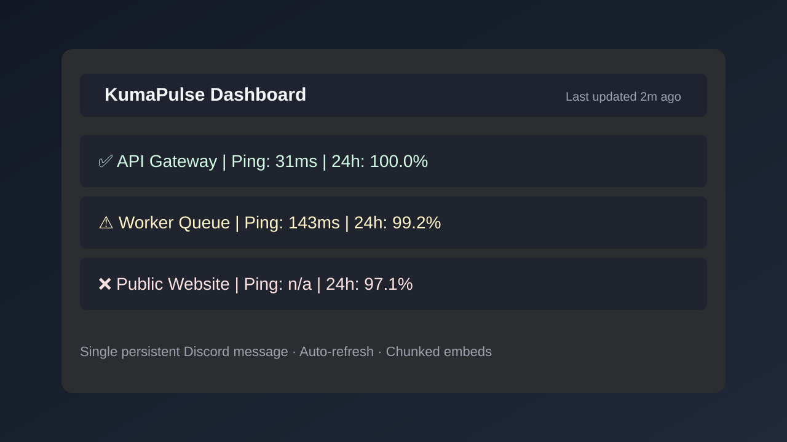
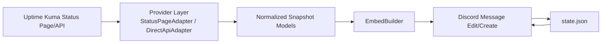

<div align="center">

# KumaPulse
### Uptime Kuma → Discord status mirror bot

[](https://www.python.org/)
[](https://discordpy.readthedocs.io/)
[](https://www.docker.com/)
[](LICENSE)

A lightweight, production-friendly Discord bot that mirrors your Uptime Kuma dashboard into **one persistent message** and continuously edits it.

</div>

---

## Screenshot



---

## Why KumaPulse?

- **Plug & Play** setup via `.env`
- **Single persistent message** (no channel spam)
- **Hybrid data provider pattern**
  - Statuspage mode (public, no auth)
  - Direct API mode (authenticated)
- **Smart update loop**
  - Skips insignificant updates (status unchanged + ping drift < 10ms)
  - Backoff to 60s if Discord returns `429`
- **Branding aware**
  - Uses statuspage title/icon/banner when available
  - Sets embed author, footer icon, image/thumbnail from scraped data
  - Tries to sync bot username/avatar to statuspage branding

---

## Architecture



### Project structure

```text
.
├── assets/
│   └── dashboard-preview.svg
├── src/
│   └── kumacord/
│   ├── bot.py
│   ├── config.py
│   ├── embed_builder.py
│   ├── models.py
│   ├── providers.py
│   └── state.py
├── .env.example
├── docker-compose.yml
├── Dockerfile
├── main.py
└── requirements.txt
```

---

## Quick Start

### 1) Configure environment

```bash
cp .env.example .env
```

Required:
- `DISCORD_BOT_TOKEN`
- `DISCORD_CHANNEL_ID`
- and either:
  - `KUMA_STATUSPAGE_URL`, or
  - `KUMA_API_URL` + `KUMA_USERNAME` + `KUMA_PASSWORD`

### 2) Run with Docker (recommended)

```bash
docker compose up -d --build
```

The bot persists message state in `./data/state.json`.

### 3) Run locally

```bash
python -m venv .venv
source .venv/bin/activate
pip install -r requirements.txt
pip install -e .
python main.py
```

---

## Environment variables

| Variable | Required | Description |
|---|---:|---|
| `DISCORD_BOT_TOKEN` | ✅ | Discord bot token |
| `DISCORD_CHANNEL_ID` | ✅ | Target text channel ID |
| `KUMA_STATUSPAGE_URL` | ✅* | Uptime Kuma statuspage URL (`.../status/<slug>`) |
| `KUMA_API_URL` | ✅* | Uptime Kuma API base URL |
| `KUMA_USERNAME` | ✅* | Uptime Kuma username |
| `KUMA_PASSWORD` | ✅* | Uptime Kuma password |
| `REFRESH_INTERVAL` | ❌ | Poll interval in seconds (default: `30`) |
| `LANGUAGE` | ❌ | Reserved for localization (default: `de`) |
| `DATA_DIR` | ❌ | Path for persistent `state.json` (default: `/app/data`) |

`*` Use Statuspage mode OR Direct API mode.

---


## Why `src/` layout?

This project now uses a `src/` layout to prevent accidental local-import side effects and to keep packaging/import behavior consistent between local runs, tests, and Docker.

Benefits:
- catches missing install/import issues earlier
- cleaner boundaries between app code and repo root scripts/assets
- scales better once tests/CI are added

---

## Architecture decision: single runtime vs Cogs

Current implementation uses a **single runtime class** (`KumaCordBot`) with a clear separation of concerns in provider/embed/state modules.
That is a good fit for this project because it has one core workflow (fetch → render → edit).

When to migrate to Cogs:
- you add slash commands (admin/setup/debug)
- you add multiple independent features (notifications, historical reports, per-channel dashboards)
- you want separate extension loading/unloading

Until then, the current non-cog structure is simpler and easier to maintain.

---

## Discord setup notes

1. Create your Discord application and bot in the Discord Developer Portal.
2. Enable required intents (default intents are sufficient for this bot).
3. Invite bot with permissions:
   - View Channel
   - Send Messages
   - Embed Links
   - Read Message History
   - Manage Messages (optional but useful)
4. Copy your channel ID (Developer Mode in Discord).

---

## Troubleshooting

### Bot starts but no message appears
- Verify `DISCORD_CHANNEL_ID` is correct and bot has channel permissions.
- Check container logs:
  ```bash
  docker compose logs -f kumacord
  ```

### Message is recreated after restart
- Ensure volume is mounted: `./data:/app/data`.
- Confirm `state.json` exists and is writable.

### Statuspage image/icon not visible
- Some status pages don’t expose all branding keys in JSON.
- Bot falls back to OG meta scraping for image/title.

### Bot profile name/avatar not changing
- Discord enforces strict user profile edit limits.
- The bot catches failures and continues normal dashboard updates.

### Too many updates / rate limits
- Delta-check skips minor ping noise.
- On HTTP 429, update interval automatically backs off to 60 seconds.

---

## Credits / Inspiration

README structure and style inspiration:
- https://github.com/matiassingers/awesome-readme
- https://github.com/othneildrew/Best-README-Template
- https://www.daytona.io/dotfiles/how-to-write-4000-stars-github-readme-for-your-project

Also inspired by projects from **@nichtlegacy**:
- https://github.com/nichtlegacy/screentime
- https://github.com/nichtlegacy/apple-health-ingester
- https://github.com/nichtlegacy/foredogs
